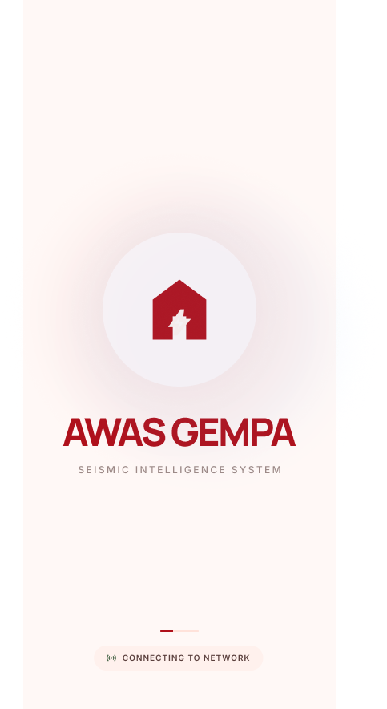
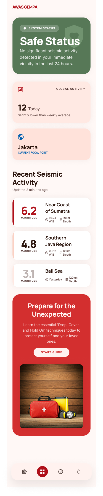
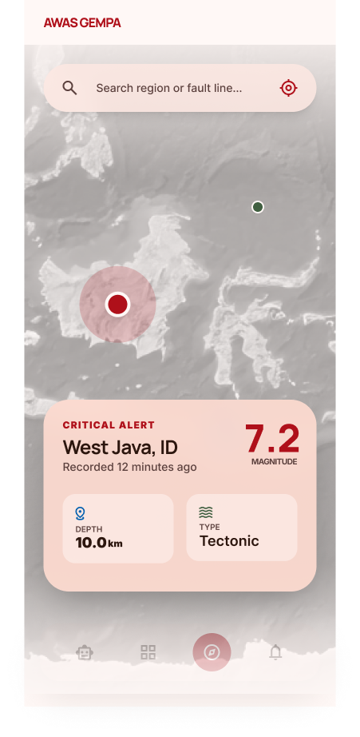
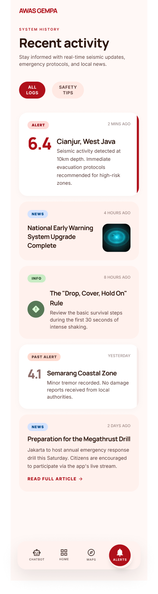
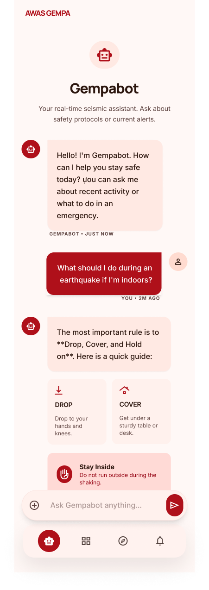
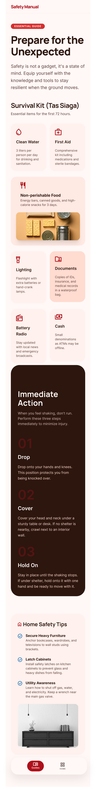

# 🌋 AWAS GEMPA — Aplikasi Informasi & Kesiapsiagaan Gempa Bumi Berbasis Android

> Tugas Akhir Mata Kuliah Pemrograman Mobile 2 — Pengembangan Lanjutan & Redesign UI/UX

---

## 👤 Identitas Mahasiswa

| Field | Keterangan |
|-------|-----------|
| **Nama** | M. Rizqy Al Rasyd |
| **NIM** | 312410424 |
| **Kelas** | I241C |
| **Mata Kuliah** | Pemrograman Mobile 2 |
| **Dosen Pengampu** | Donny Maulana, S.Kom., M.M.S.I. |
| **Project Management** | [ClickUp Board]([https://app.clickup.com/90181799294/v/s/90187327418](https://app.clickup.com/90181810061/v/b/li/901816401804)) |

---

## 📖 Deskripsi Proyek

**AWAS GEMPA** adalah aplikasi informasi dan kesiapsiagaan gempa bumi berbasis Android yang dirancang untuk membantu masyarakat Indonesia memantau aktivitas seismik, menerima notifikasi peringatan dini, serta mendapatkan panduan keselamatan saat terjadi gempa. Aplikasi ini menggabungkan data gempa real-time, chatbot asisten darurat, dan panduan survival dalam satu platform yang mudah digunakan.

---

## 🛠️ Teknologi yang Digunakan

| Komponen | Teknologi |
|----------|-----------|
| Bahasa Pemrograman | Java |
| Platform | Android |
| UI Design | XML + Material Design |
| IDE | Android Studio |
| Data Lokal | SharedPreferences |
| Design Tool | Figma |

---

## ✨ Fitur Utama

- 🟢 **Status Keamanan Real-time** — Tampilkan status keamanan wilayah berdasarkan aktivitas seismik terkini
- 🗺️ **Peta Seismik Interaktif** — Visualisasi lokasi dan kekuatan gempa di peta
- 🔔 **Notifikasi Peringatan Dini** — Notifikasi berjenjang (Safe / Stay Vigilant / Prepare for Impact / Critical Alert)
- 📊 **Aktivitas Seismik Terbaru** — Daftar gempa terkini dengan magnitudo, lokasi, dan kedalaman
- 🤖 **Gempabot (Chatbot)** — Asisten virtual untuk menjawab pertanyaan seputar gempa dan prosedur darurat
- 📚 **Panduan Keselamatan (Safety Guide)** — Panduan lengkap persiapan menghadapi gempa dan survival kit
- 🚨 **Level Alert Otomatis** — Sistem peringatan berlapis berdasarkan intensitas gempa

---

## 🎨 Desain UI — Penjelasan Tiap Halaman

### 1. 💧 Splash Screen
Halaman pertama yang muncul saat aplikasi dibuka. Menampilkan **logo dan nama AWAS GEMPA** di tengah layar dengan ikon rumah/shelter sebagai simbol keselamatan. Berfungsi sebagai identitas brand dan transisi awal sebelum aplikasi terhubung ke jaringan data seismik.

---

### 2. 🏠 Home *(Beranda)*
Halaman utama aplikasi yang menampilkan kondisi keselamatan terkini secara menyeluruh. Berisi:
- **Status Badge** di bagian atas — menampilkan status sistem (*System Status: Safe Status*) beserta keterangan aktivitas seismik di sekitar lokasi pengguna dalam 24 jam terakhir
- **Global Activity** — ringkasan aktivitas gempa secara global
- **Informasi Kota** — menampilkan nama kota pengguna saat ini (contoh: Jakarta)
- **Recent Seismic Activity** — daftar gempa terbaru yang diurutkan berdasarkan waktu, menampilkan:
  - Magnitudo (contoh: 6.2, 4.8, 3.1)
  - Lokasi episentrum (Near Coast of Sumatera, Southern Java Region, Bali Sea)
  - Jarak dari lokasi pengguna & kedalaman gempa
- **Banner Edukasi** di bagian bawah — mengarahkan pengguna ke halaman panduan keselamatan (*"Prepare for the Unexpected"*)

---

### 3. 🗺️ Maps *(Peta Seismik)*
Halaman peta interaktif yang memvisualisasikan aktivitas gempa secara geografis. Menampilkan:
- **Peta wilayah** dengan titik-titik lokasi gempa yang ditandai
- **Popup detail gempa** saat pengguna mengetuk titik lokasi, berisi:
  - Nama wilayah (contoh: *West Java, ID*)
  - Magnitudo (contoh: **7.2**)
  - Kedalaman (*10.0 km*)
  - Jenis gempa (*Tectonic*)
- **Label CRITICAL ALERT** pada gempa dengan magnitudo tinggi
- **Search bar** di bagian atas untuk mencari wilayah tertentu
- **Indikator dot navigasi** di bagian bawah peta

---

### 4. 🔔 Notif *(Notifikasi & Aktivitas)*
Halaman riwayat aktivitas dan notifikasi peringatan gempa. Berisi:
- **Filter tab** — ALL / ALERT untuk menyaring jenis notifikasi
- **Kartu aktivitas gempa** terbaru, masing-masing menampilkan:
  - Magnitudo dan lokasi (contoh: *6.4 Cianjur, West Java*)
  - Waktu kejadian dan status peringatan
- **Notifikasi sistem** seperti:
  - *National Early Warning System Upgrade Complete*
- **Kartu panduan aksi darurat:**
  - *"The 'Drop, Cover, Hold On' Rule"* — langkah-langkah 30 detik pertama saat gempa
  - *Screaming Coastal Zones* — panduan evakuasi tsunami
  - *Preparation for the Megathrust Drill* — informasi simulasi bencana
- Setiap kartu memiliki tombol **"READ FULL ARTICLE"** untuk membaca panduan lengkap

---

### 5. 🤖 Charbot *(Gempabot — AI Chatbot)*
Halaman chatbot asisten gempa bernama **Gempabot**. Fitur yang tersedia:
- **Header Gempabot** dengan deskripsi: *"Your real-time seismic assistant. Ask your safety questions or current alerts."*
- **Antarmuka percakapan** chat bubble antara pengguna dan Gempabot
- Contoh pertanyaan yang dapat diajukan:
  - *"What is the latest seismic activity in my area?"*
  - *"What should I do during an earthquake I'm indoors?"*
  - *"Ask me anything..."*
- **Quick reply suggestion** berupa chip/tombol pertanyaan cepat di bawah input
- **Input field** dengan ikon kirim di bagian bawah layar
- **Bottom navigation bar** untuk akses ke halaman lain

---

### 6. 📚 Guide *(Panduan Keselamatan)*
Halaman panduan keselamatan lengkap bertajuk **"Safety Manual"** dengan subtitle *"Prepare for the Unexpected"*. Berisi:
- **Kutipan motivasi keselamatan:** *"Safety is not a gadget, it's a state of mind. Equip yourself with the knowledge and tools to stay resilient when the ground moves."*
- **Survival Kit (Tas Siaga)** — daftar perlengkapan darurat yang wajib disiapkan, ditampilkan dalam format kartu grid dengan ikon:
  - 💧 **Clean Water** — kebutuhan air bersih per orang per hari
  - 🩹 **First Aid** — perlengkapan P3K termasuk obat-obatan
  - 🥫 **Non-perishable Food** — makanan tahan lama, kaleng, dan camilan bergizi
  - 🔦 **Lighting** — senter, lampu darurat, dan baterai cadangan
  - 📄 **Documents** — salinan dokumen penting dalam wadah tahan air
  - 🔋 **Battery Radio** — untuk menerima informasi darurat tanpa internet
  - 💵 **Cash** — uang tunai untuk keadaan darurat saat ATM tidak berfungsi

---

## 🚨 Sistem Level Alert

Aplikasi AWAS GEMPA menggunakan sistem peringatan berlapis yang ditampilkan di bagian atas aplikasi:

| Level | Warna | Deskripsi |
|-------|-------|-----------|
| 🟢 **Safe Status** | Hijau | Tidak ada aktivitas signifikan di sekitar lokasi dalam 24 jam terakhir |
| 🟡 **Stay Vigilant** | Kuning | Aktivitas rendah terdeteksi. Pantau terus dan ketahui zona aman terdekat |
| 🟠 **Prepare for Impact** | Oranye | Aktivitas signifikan terdeteksi. Segera amankan barang dan cari zona aman |
| 🔴 **Critical Alert / EARTHQUAKE DETECTED** | Merah | Gempa kuat terdeteksi. EVAKUASI SEGERA ke lokasi aman atau ikuti rute evakuasi |

---


### 📱 Alur Utama: Pemantauan & Respons Gempa

```
[Splash Screen]
      │
      ▼ (Auto redirect + koneksi jaringan)
[Home / Beranda]
      │
      ├──── Tap ikon Peta ──────────────► [Maps — Peta Seismik]
      │                                         │
      │                                         ▼
      │                                   Tap titik gempa
      │                                         │
      │                                         ▼
      │                                  [Detail Gempa Popup]
      │
      ├──── Tap ikon Notifikasi ────────► [Notif — Aktivitas & Alert]
      │                                         │
      │                                         ▼
      │                                  Tap artikel panduan
      │                                         │
      │                                         ▼
      │                                  [Artikel Lengkap]
      │
      ├──── Tap ikon Gempabot ──────────► [Charbot — Gempabot AI]
      │                                         │
      │                                         ▼
      │                                  Tanya pertanyaan darurat
      │                                         │
      │                                         ▼
      │                                  [Respons AI Gempabot]
      │
      └──── Tap ikon Guide ─────────────► [Safety Guide — Panduan]
                                                │
                                                ▼
                                        Lihat Survival Kit &
                                        Panduan Keselamatan
```

| Halaman | Preview |
|--------|---------|
| Splash Screen |  |
| Home |  |
| Maps |  |
| Notif |  |
| Chatbot |  |
| Guide |  |


### 🔔 Storyboard Skenario Alert (Darurat)

| # | Skenario | Respons Aplikasi | Tindakan Pengguna |
|---|----------|-----------------|-------------------|
| 1 | Gempa M < 4.0 terdeteksi | Banner **Stay Vigilant** (kuning) muncul | Pantau notifikasi |
| 2 | Gempa M 4.0–5.9 terdeteksi | Banner **Prepare for Impact** (oranye) + notifikasi push | Cari zona aman, cek panduan |
| 3 | Gempa M ≥ 6.0 terdeteksi | Banner **CRITICAL ALERT** (merah) + notifikasi prioritas tinggi | EVAKUASI SEGERA |
| 4 | Beranda dibuka | Status otomatis diperbarui | Lihat kondisi terkini |
| 5 | Pengguna bertanya ke Gempabot | AI merespons dengan panduan keselamatan relevan | Ikuti instruksi Gempabot |

---

## 📁 Struktur Proyek

```
AwasGempa/
├── app/
│   └── src/
│       └── main/
│           ├── java/
│           │   └── com.awasgemppa/
│           │       ├── activity/       # Activity utama (Home, Maps, dll)
│           │       ├── adapter/        # RecyclerView Adapters
│           │       ├── model/          # Data model (Earthquake, Alert, dll)
│           │       ├── api/            # Koneksi data seismik
│           │       └── utils/          # Helper & SharedPreferences
│           ├── res/
│           │   ├── layout/             # File XML layout
│           │   ├── drawable/           # Icon & gambar
│           │   └── values/             # Colors, strings, themes
│           └── AndroidManifest.xml
└── gempa/                           # Screenshot Figma
```

---

## 📊 Hasil Pengujian

| Fitur | Status |
|-------|--------|
| Tampilkan Status Keamanan | ✅ Berhasil |
| Peta Seismik Interaktif | ✅ Berhasil |
| Sistem Level Alert (4 Level) | ✅ Berhasil |
| Notifikasi Push Alert | ✅ Berhasil |
| Riwayat Aktivitas Seismik | ✅ Berhasil |
| Gempabot (Chatbot) | ✅ Berhasil |
| Panduan Keselamatan & Survival Kit | ✅ Berhasil |
| Bottom Navigation | ✅ Berhasil |

---

## 🚀 Cara Menjalankan Proyek

1. Clone repositori ini:
   ```bash
   git clone https://github.com/username/AwasGempa.git
   ```
2. Buka dengan **Android Studio**
3. Tunggu Gradle sync selesai
4. Jalankan di emulator atau perangkat fisik Android (min API 21)

---

## 📌 Kesimpulan

Aplikasi AWAS GEMPA berhasil menghadirkan solusi informasi dan kesiapsiagaan gempa bumi dalam satu platform Android yang terintegrasi, meliputi:
- Sistem peringatan dini berlapis berdasarkan intensitas gempa
- Visualisasi peta seismik interaktif
- Chatbot asisten darurat berbasis AI (Gempabot)
- Panduan survival kit dan keselamatan yang komprehensif
- Antarmuka modern yang mudah digunakan dalam kondisi darurat sekalipun

---

*Dikembangkan sebagai tugas akhir Mata Kuliah Pemrograman Mobile 2 — Universitas Pelita Bangsa*
